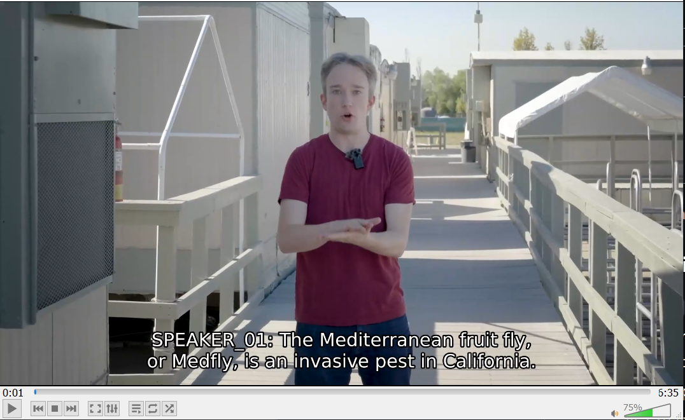

# Inline video subtitles with Whisper

`python run.py --media_path=https://www.youtube.com/watch?v=Zl_5LT2fzak --diarize --save_to_path=tomscott`

## Setup and installation

- Find the proper PyTorch 2.0 installation for your system:
  - <https://pytorch.org/get-started/previous-versions/#v200>
- run `make`

To support speaker diarization, you need to save your huggingface token in `secrets.yml` in the root dir:

1. Create a huggingface account
2. Accept the terms at <https://huggingface.co/pyannote/speaker-diarization-3.1>
3. Create a token from <https://huggingface.co/settings/tokens>
4. Create `secrets.yml` in the root dir with the following content:

    ```yaml
    HF: <your-token>
    ```

## Usage

`python run.py --media_path=<url|path> --diarize --save_to_path=<filename>`

if you do not enable `save_to_path`, the audio/video/subtitles will be left as separate files in the temporary `store` folder.

## With other languages/models

Optional models must support FasterWhisper/WhisperX

- `--model=<model-name>`
  - Example model:
  - Norwegian Bokmål: `NbAiLabBeta/nb-whisper-small`

